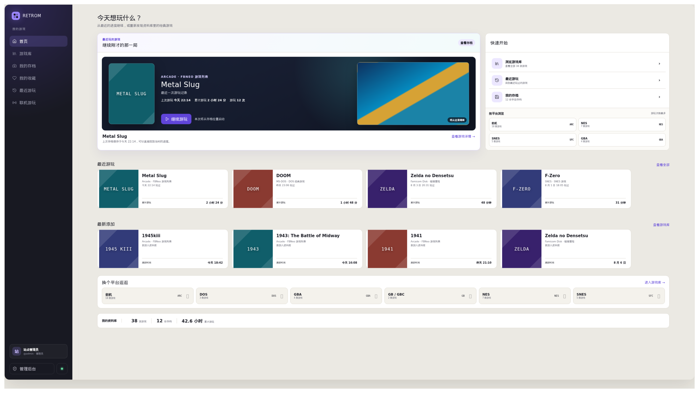
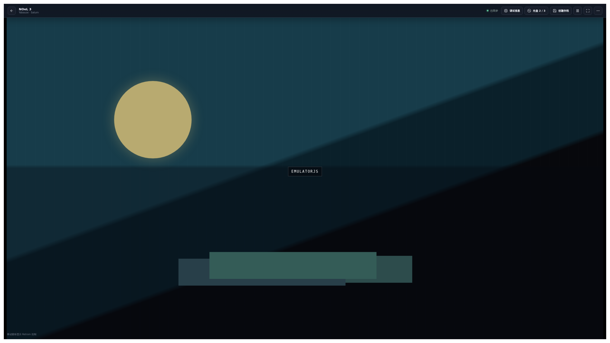

# Retrom

Retrom 是一个供你和可信朋友使用的自托管复古游戏 Web 平台。它把游戏导入、整理、审核、浏览和游玩放在同一个站点中，并通过浏览器内的 EmulatorJS 运行游戏。

> Retrom 正在持续开发。当前正式支持 Chrome；不同游戏、核心和 BIOS 组合的兼容性仍有差异，部署到长期使用环境前请先验证自己的游戏库。

## 一眼看看 Retrom

把散落在硬盘里的游戏整理成自己的资料库，回到首页就能接着上次的进度继续。



点开游戏即可在浏览器里游玩，资料库、运行环境和存档仍由 Retrom 安静地照看。



<sub>画面使用演示标题与抽象占位图生成；截图为物理 4K、150% 系统缩放效果，不包含游戏内容。</sub>

## 你可以用它做什么

- 浏览、搜索和筛选已经发布的游戏，并从详情页直接开始游戏。
- 保存带截图的手动存档，从首页、详情页或存档页继续游玩。
- 查看最近游玩与有效游玩时长，使用私有收藏和收藏夹整理游戏。
- 导入单个文件、目录、压缩包和受支持的多盘内容，通过 SHA-256 去重。
- 由管理员审核元数据、封面、游戏目录、核心、BIOS 和 Arcade Parent 依赖后再发布。
- 通过邀请与可信朋友共享游戏库，同时隔离每个账号的存档和游玩记录。
- 在显式启用后，使用受限的双人异地联机功能。目前联机只覆盖锁定版本的 FCEUmm 与 FBNeo 核心配置。

## 如果你只是玩家

你不需要安装任何客户端。使用最新版 Chrome 打开管理员提供的 HTTPS 地址，接受邀请并登录即可。普通页面支持手机、平板和桌面；移动端进入 Player 前需要切换到稳定横屏。

Retrom 不提供匿名公开访问。你的存档、最近游玩和收藏对其他普通用户不可见，管理员也没有读取其他用户私有游玩数据的管理入口。

## 本地体验

下面的方式会以开发测试模式在本机启动 Retrom，适合首次体验和参与开发，**不适合暴露到公网或保存正式数据**。

### 环境要求

- Linux x86-64
- Git、Make、Python 3、`curl`、`tar` 和 `xz`
- 支持 C++20 的 `g++`
- `7z` 或 `7zz`
- 首次初始化时可访问互联网

Go、Node.js、Web 依赖、固定版本的 Chrome for Testing、EmulatorJS、核心、DAT 与许可文件会由项目命令下载并校验，无需预先安装 Go、Node.js 或 Chrome；已安装且版本完全一致的 Go 会被直接复用。

### 启动步骤

```bash
git clone https://github.com/retrom-project/retrom.git
cd retrom

make install-deps
make dev
```

首次执行 `make install-deps` 需要下载依赖，耗时取决于网络和磁盘性能；后续会复用 `.cache/` 与其他被忽略目录中的已校验缓存。

服务就绪后访问 [http://localhost:4000](http://localhost:4000)，开发测试账号为：

- 用户名：`test`
- 密码：`test`

使用 `Ctrl+C` 会同时停止前后端进程。本地测试数据默认保存在 `.dev-data/data/`，删除或替换该目录会丢失本地账号、游戏和存档。Next 与 Go 默认只监听宿主 `127.0.0.1:4000/8080`，不需要本地域名、hosts 文件或 TLS 证书。`make dev` 与全部 `make pfb-*` 命令必须由当前普通用户直接运行；不要使用 root 或 `sudo`，入口会在准备依赖或启动服务前明确拒绝。

### PFB 并行联调

需要同时运行多个功能分支时，使用独立的 PFB 命令族。每个 PFB 应位于独立 Git worktree；应用容器不发布宿主端口，只有共享网关监听 `127.0.0.1:3000`。普通 `make dev` 使用 4000，因此可与 PFB 网关同时运行；PFB 应用与共享网关容器都显式使用发起命令的普通用户 UID/GID。

初始化轻量 PFB（即使只改 Retrom，也需要同一 PFB 中的 runtime worktree 作为开发 provider watcher）：

```bash
make pfb-init PFB=feat-library-filter \
  RUNTIME_ROOT=/absolute/path/to/retrom-runtime
make pfb-validate PFB=feat-library-filter
make pfb-build PFB=feat-library-filter
make pfb-up PFB=feat-library-filter
```

`pfb-up` 默认把当前 PFB 选为裸 [http://localhost:3000](http://localhost:3000) 的 307 跳转目标；该实例自身的稳定地址为命令输出的 `http://<pfb-id>.localhost:3000`。`make pfb-use PFB=<name>` 可切换选择，不会影响其他已经运行的 PFB。

联调 runtime 或 core 分支时，初始化命令显式给出各自的绝对 worktree：

```bash
make pfb-init \
  PFB=feat-ons-save \
  RUNTIME_ROOT=/absolute/path/to/retrom-runtime \
  CORE_ROOTS='{"onsyuri":"/absolute/path/to/OnscripterYuri"}'
make pfb-validate PFB=feat-ons-save
make pfb-build PFB=feat-ons-save
make pfb-up PFB=feat-ons-save
```

`pfb-build` 只在首次使用或 package/toolchain 定义变化时准备开发镜像、Node/Go 依赖与生成代码；它不构建 Provider archive、core 或 release candidate。新环境通过显式、upgrade-only 的 `pfb-provider-import` 复用已验证 Provider 基座，旧命名卷则通过一次 `pfb-migrate-storage` 保留数据迁移。日常修改直接由 bind mount 生效：Web 使用 Next HMR，Go 修改后执行 `pfb-restart`，`retrom-runtime` adapter 由轻量 watcher 只重建开发 `client.mjs` 和本地 adapter 资源，随后执行一次 `pfb-restart` 让 Go 重新装载 revision。`pfb-up` 固定使用 Compose `--no-build`，`pfb-restart` 只重启已有容器。

持久数据库、CAS、上传、provider 基座与依赖/cache 位于当前 Retrom worktree 的 `.pfb/workspace/`，因此同一 PFB 的 ID、URL 和数据不会因 down/up/restart 改变。旧命名卷实例先停止，再用 `make pfb-migrate-storage PFB=<name> CONFIRM=<pfb-id>` 一次性原子迁移；源卷保留。只有真正不兼容的开发数据变化才使用 `pfb-data-reset`，它会先归档旧数据。core 永远只由显式 `make pfb-core-build PFB=<name> CORE=<id>` 构建。完整操作与安全边界见 [PFB 轻量开发容器](docs/pfb-development.md)。

使用 `make pfb-status PFB=<name>` 查看容器、健康、workspace、开发 provider revision 与 URL；`make pfb-verify PFB=<name>` 保存隔离检查证据。`pfb-down` 保留 workspace，`pfb-remove` 保留 workspace 但移除容器/注册，`pfb-destroy PFB=<name> CONFIRM=<pfb-id>` 才删除该 worktree 的 `.pfb/` 状态。严格前置为 Linux x86-64（含 WSL2）、默认本机 Docker context、Compose v2 和仓库锁定的 Chrome；不支持的平台由 `pfb-validate` 明确拒绝。

## 添加自己的游戏

Retrom 不随项目提供或下载商业 ROM、BIOS，也不会把操作者的私有 ROM/BIOS 用作自动化测试数据。请只导入你有权使用的内容。

本地开发时可以采用两种方式：

1. 登录管理后台，通过浏览器上传文件或目录并进入审核流程。
2. 将服务器侧导入内容放入 `.dev-data/roms/`，将 BIOS 放入 `.dev-data/bios/`，再从管理后台选择对应的本地扫描目录。

`.dev-data/` 只用于本机开发导入，已被 Git 忽略，不属于 Retrom 的持久数据根。服务器目录导入适合 Pegasus 格式的游戏库；普通游戏也可以直接使用浏览器导入。

不同平台需要的文件格式、核心和 BIOS 不同。Arcade 游戏还可能需要匹配核心版本的 Parent ROM、BIOS 与 DAT。遇到内容无法发布或启动时，请先查看管理后台给出的阻断项，再参考 [BIOS 与 Arcade 说明](docs/bios-and-arcade.md)和[核心运行时覆盖](docs/core-runtime-validation.md)。

## 生产部署

项目可以构建两个 OCI/Docker 镜像：

```bash
make build-images
```

默认产物为：

- `retrom:latest`：Go 后端、任务、SQLite/CAS、运行时和内容端点，内部 HTTP 端口 `8080`。
- `retrom-web:latest`：Next.js Web 界面，内部 HTTP 端口 `3000`。

`make build-images` 只构建并校验镜像，不会创建容器、网络或数据卷，也不会自动部署。当前仓库没有提供通用的一键 Compose 配置；生产环境需要由部署者补充 Compose、Kubernetes 或其他编排，并满足以下边界：

- 使用 Nginx 或其他反向代理提供单一 HTTPS Origin，并把页面请求转发到 Web、API 与运行时请求转发到后端。
- 两个应用进程只监听受信网络中的明文 HTTP；TLS、证书、HSTS 和 HTTP 到 HTTPS 跳转由反向代理负责。
- 为后端挂载独立、持久且可写的 `RETROM_DATA_DIR`，不要把它放在代码或依赖目录中。
- 生产运行身份应由编排明确指定；当前基线是 UID/GID `1000:1000`，数据卷必须允许该身份写入。
- 显式配置 HTTPS 的 `RETROM_PUBLIC_ORIGIN`，并按需配置只读 ROM/BIOS 导入目录、可信代理、多盘和联机开关。

全新生产数据根首次启动后会停留在初始化页面。主机操作者需在相同数据与依赖配置下运行 `retrom setup-code`，再在 `/setup` 使用该一次性证明创建首位管理员。完整环境变量、同源路由与初始化要求见[后端与部署说明](docs/backend-api-and-operations.md)。

## 数据与备份

Retrom 将 SQLite、内容寻址文件、上传暂存和运行密钥统一保存在 `RETROM_DATA_DIR`。第三方 EmulatorJS、核心和 DAT 依赖位于独立的只读依赖根；它们不是用户数据备份的一部分。

备份必须在 Retrom 服务停止后执行，并写入一个尚不存在、位于数据根之外的绝对路径：

```bash
retrom backup --output /backup-volume/retrom-backup
```

恢复也只会创建新的数据根，不会覆盖已有目录：

```bash
retrom restore \
  --input /backup-volume/retrom-backup \
  --output-data-dir /srv/retrom-restored
```

恢复前必须准备与备份记录完全一致的依赖版本。恢复会撤销旧登录、邀请和启动会话，用户需要重新登录。完整流程见[存储、备份与恢复](docs/storage-and-database.md#8-备份与恢复)。

## 常用命令

| 命令 | 用途 |
| --- | --- |
| `make install-deps` | 初始化并校验开发、测试所需的固定依赖 |
| `make dev` | 在宿主机启动 Go 后端和 Next.js 开发服务 |
| `make pfb-init/build/up` | 初始化、准备开发工具链并启动隔离的并行功能分支环境 |
| `make pfb-status/use/down` | 查看、选择或停止一个 PFB 环境 |
| `make ci` | 运行仓库内可重复的质量、单元、集成和数据检查 |
| `make web-e2e` | 使用项目自有的 GBA 与 Arcade 测试程序运行 Chrome 产品 E2E |
| `make build-images` | 构建并校验后端与 Web 镜像 |
| `make deps-check` | 离线校验已物化的运行时、核心、DAT 和许可文件 |

## 当前兼容性边界

- Chrome 是当前唯一承诺支持的浏览器。
- 仓库配置了多个 EmulatorJS 核心，但不能把配置存在等同于所有真实游戏均已验证。当前公开的产品 E2E 覆盖项目自有的 mGBA 冒烟程序，以及 MAME 2003、FBNeo 的 DAT/Split/Parent/BIOS 交付和单机帧执行链路。
- FCEUmm、FBA2012 和其他未登记产品 E2E 的核心仍需要部署者使用合法内容自行验证；FBNeo 当前没有双浏览器联机运行基线。
- 异地联机默认在生产环境关闭；即使启用，也只适用于机器清单精确允许且已通过普通启动检查的游戏。
- Retrom 不包含 MFA、邮件找回、外部身份提供商、聊天、观战或 Arcade Merged ROMset 支持。

详细的已验证与未验证范围见[核心运行时验证基线](docs/core-runtime-validation.md)。

## 更多文档

- [文档索引](docs/README.md)：所有正式设计、运行、测试与验收文档的入口。
- [产品与架构总览](docs/retrom-product-architecture.md)：产品范围和关键概念。
- [导入与审核](docs/import-and-review.md)：普通导入、Pegasus、元数据和发布流程。
- [运行、Player 与存档](docs/runtime-and-play-data.md)：启动、全屏、存档和游玩时长。
- [依赖管理](docs/dependency-management.md)：EmulatorJS、核心、DAT、下载与许可边界。
- [工程质量与测试](docs/engineering-quality-and-testing.md)：开发命令、CI 和测试策略。

发现问题时，请在 GitHub 仓库提交 Issue，并附上 Retrom 版本、浏览器版本、相关平台/核心和管理后台显示的稳定错误码。不要上传 ROM、BIOS、存档、密码、Cookie、启动凭据或完整的本机路径。
