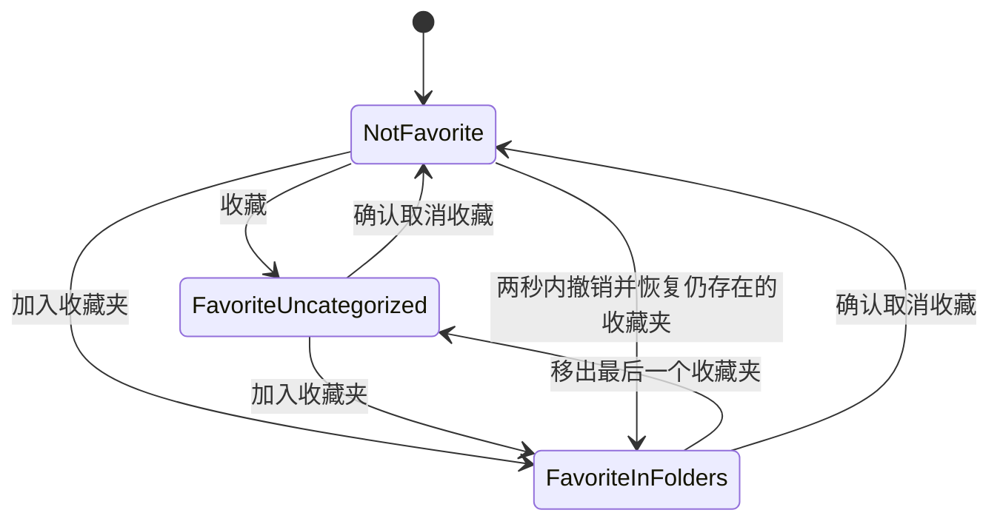

# 收藏与收藏夹

本文是 Retrom 收藏能力的跨模块专题入口，负责维护领域边界、跨层不变量、事务边界和发布策略。字段与数据库约束只在 [`data-model.md`](./data-model.md) 维护，HTTP 细节只在 [`http-api-contract.md`](./http-api-contract.md) 维护，页面行为只在 [`ui-specification.md`](./ui-specification.md) 维护，测试门禁见 [`engineering-quality-and-testing.md`](./engineering-quality-and-testing.md)，验收流程只在 [`project-acceptance.md`](./project-acceptance.md) 维护。

## 1. 术语与领域边界

| 术语 | 唯一含义 |
| --- | --- |
| Favorite / 收藏 | `(profile_id, game_id)` 的私有关系，表示当前认证 Profile 收藏共享 Game。 |
| FavoriteFolder / 收藏夹 | Profile 私有的命名容器；数据库、Go 和 API 使用 `favorite_folder`，不使用含糊的 `collection`。 |
| FolderMembership / 收藏夹成员 | 一项 Favorite 与一个 FavoriteFolder 的多对多关系。 |
| 全部收藏 | 当前 Profile 中仍对用户可见的全部 Favorite 派生视图，不落库。 |
| 未分类 | 当前 Profile 中仍可见且没有任何 FolderMembership 的 Favorite 派生视图，不落库。 |
| 游戏集合 | 现有 PlatformInstance 的用户侧文案；它是 Game 的唯一归属，不是收藏夹。 |

锁定边界如下：

- 同一 Game 可以被多个 Profile 分别收藏；任何角色都没有跨 Profile 查看、搜索或维护收藏数据的旁路。
- 一项 Favorite 可以进入零到多个 FavoriteFolder。加入 Folder 会自动收藏；从最后一个 Folder 移除后 Favorite 保留并进入“未分类”。
- 删除 Folder 只删除该 Folder 及其 Membership，不取消 Favorite；取消 Favorite 才在同一事务删除其全部 Membership。
- 收藏不改变 Game、PlatformInstance、GameContentRevision、GameVariantRevision、Launch、SaveState 或 PersistentSave 的归属和运行行为。
- Game 软删除、PlatformInstance 停用或 User 停用只隐藏用户投影，不删除收藏关系；资源恢复可见后原关系自然恢复。
- 本能力不引入公开/分享/协作收藏夹、嵌套、描述、封面、图标、手工排序、智能规则、推荐、统计榜或管理员审计事件。
- 本能力不引入后台 Job、Blob、外网请求、浏览器持久副本、Core/DAT/BIOS/Player 变化或新的第三方依赖。

Migration 034 的实例 Tag 与本专题完全独立：Tag 由 ADMIN 预先创建并可跨 Profile 展示在可见 Game 上，FavoriteFolder 由每个用户管理且只有 owner 可见。收藏页必须把游戏 Tag 与紫色 Folder chip 放在两个有独立可访问 label 的区域；按标签的 `q` 只过滤可见游戏，不允许用 Tag API 推断其他 Profile 的收藏。Tag 细节见 [`game-tags.md`](./game-tags.md)。

## 2. 用户行为不变量

收藏状态只有三种可观察结果：未收藏、已收藏且未分类、已收藏且属于一个或多个 Folder。



- 重复收藏成功但不刷新最初的 `favoritedAtMs`；取消后再次主动收藏会产生新的收藏时间。
- 精确替换 `folderIds=[]` 只清空分类，不取消收藏。批量 add/remove 集合互斥，任一非法项使整批零写入。
- 取消收藏前必须说明会同时移除多少个 FolderMembership，默认焦点为“保留收藏”。成功后提供固定两秒的内存撤销；快照不得写入 URL 或浏览器存储。
- 撤销不重建期间已删除的 Folder：可见 Game 恢复 Favorite，只恢复当前仍存在且属于同一 Profile 的 Folder，并报告跳过项。
- Folder 不做软删除。重命名只改变规范名称并把 `version` 精确加一，不改变 ID、创建时间、成员或顺序；删除后名称可以复用，旧 ID 永不复用。
- 每个 Profile 最多 100 个 Folder，固定按 `created_at_ms ASC, id ASC` 展示；“全部收藏”和“未分类”不能重命名或删除。

## 3. 模块与事务边界

实现依赖方向固定为：

```text
internal/httpapi/favorite_handlers.go
            ↓
internal/favorites
            ↓
database/sql + 既有 authn/cursor/idempotency
```

- Handler 只负责严格协议解析、认证主体提取与稳定错误映射；名称规范、上限、集合差异、可见性和事务属于 `internal/favorites`。
- UUID、批量边数、JSON 和名称格式在事务前校验；所有可见性、owner、Folder 数量与版本在短 `BEGIN IMMEDIATE` 事务内重新校验。
- 收藏、精确分类、创建 Folder、批量整理、取消、恢复和删除 Folder 都以一次事务提交；事务内不访问网络、文件系统或 Blob，也不逐 Game 提交。
- 取消收藏按 Membership → Favorite 删除，删除 Folder 按 Membership → Folder 删除；数据库使用限制型外键，不用隐藏级联代替业务顺序。
- 列表、总计数、Folder 可见计数、平台摘要和当前页来自同一只读事务。主查询先按 Principal、PUBLISHED Game 和 enabled PlatformInstance 限定，不能先读其他 owner 或隐藏 Game 再在 Go 过滤。
- Membership 按当前页 Game ID 集合一次聚合，Folder count 使用集合查询；不得形成每张卡一次查询。查询计划由索引断言保护，不使用易抖动的耗时阈值。

字段、索引、trigger 和 Migration 025 的精确定义见 [`data-model.md`](./data-model.md)；route、DTO、上限、cursor、ETag、幂等和错误见 [`http-api-contract.md`](./http-api-contract.md)。

## 4. 隔离、安全与并发结果

- 每条读写 SQL 都使用认证 Principal 的 `profile_id`；客户端给出的 Game/Folder ID 只是资源选择，不是 owner 证明。
- 外部 Profile 的 Folder 与不存在 Folder 返回同一 404；Folder 名称、版本、成员数和收藏计数不得通过错误、日志、diagnostics 或管理 API 泄漏。
- Cursor filter digest 和 Idempotency-Key namespace 绑定 Principal User ID；两个账号可以复用同一 key，但不能重放彼此结果。
- Folder 名称只按普通文本渲染，不支持 Markdown/HTML；日志不记录请求 body、搜索文本、Folder 展示名、Profile ID 或用户收藏数量。
- 两个标签页同时收藏同一 Game 时复合主键收敛为一行；收藏与取消的最终状态由 SQLite 提交顺序决定，客户端在写成功后丢弃旧 cursor 并刷新首页。
- 等价 Folder 名并发创建只允许一个提交；重命名/删除使用 `If-Match`，先提交者成功，另一方返回版本冲突并要求用户复核，不自动覆盖。
- Folder 删除与 organize 竞争时，要么 organize 因 Folder 已删除返回 404，要么成员先加入后随 Folder 删除而移除；两种结果都保留 Favorite。

## 5. 页面接入与设计源

- 一级导航顺序固定为首页、游戏库、我的存档、我的收藏、最近游玩；收藏页路由为 `/favorites`。
- 游戏库卡片、游戏详情和收藏页共享服务端 Favorite 投影；首页、最近游玩、存档页和 Player 不新增首批收藏入口。
- 收藏页的 Rail、筛选、卡片、Folder 管理、批量栏、状态与无障碍细节见 [`ui-specification.md`](./ui-specification.md)。
- 可维护的交互设计源是 [`design/retrom-ui-review.fragment.html`](./design/retrom-ui-review.fragment.html)，由它生成 [`design/retrom-ui-review.html`](./design/retrom-ui-review.html)。收藏主页面、Folder 管理与取消收藏确认可由 capture 脚本在本地生成图片复核，但图片由 `docs/design/.gitignore` 忽略且不被正式文档引用。设计中的标题、封面和数量仅用于评审，不进入 seed、fixture 或生产默认值。

## 6. 发布、回滚与验证

- Web 与后端按同一 release-input 组合发布；新 Web 不单独部署到缺少收藏 API 的旧后端。Migration 025 完成后直接启用，不需要 feature flag 或运行期物化。
- 首次进入的所有账号都是空收藏状态；不得从最近游玩、存档、平台图钉或浏览器历史推断收藏。
- 发布前执行离线 backup。回滚旧应用时停止服务并恢复发布前的完整数据根；不得删除 025 表、手工降低 `schema_migrations` 或让旧二进制继续写新 schema。
- 数据与后端最低自动化见 [`engineering-quality-and-testing.md`](./engineering-quality-and-testing.md#71-后端与数据)，前端与浏览器最低自动化见 [`engineering-quality-and-testing.md`](./engineering-quality-and-testing.md#72-前端与浏览器)。
- 正式通过只以 [`ACC-FAV-001`–`004`](./project-acceptance.md#16-收藏与收藏夹) 的当次结果为准；专题不复制 Case 流程或通过标准。

当字段、route、UI 行为或验收标准变化时，必须修改其唯一事实源和对应自动化，不能在本专题建立第二份可执行契约。
