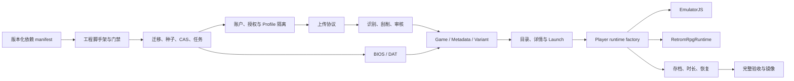

# 一期实施编排与交付门禁

| 属性 | 内容 |
| --- | --- |
| 文档状态 | 已审定 / 一期实施基线 |
| 版本 | 1.6 |
| 日期 | 2026-08-25 |
| 用途 | 规定实现顺序、依赖和里程碑退出条件，不复制领域规格 |

## 1. 使用方式

本文回答“按什么顺序实现才不会返工”。产品边界以[总体架构](./retrom-product-architecture.md)为准，数据库字段以[数据模型](./data-model.md)为准，HTTP 以[API 契约](./http-api-contract.md)和实现后的 `api/openapi.yaml` 为准，最终通过与否只以[统一验收](./project-acceptance.md)为准。本文不得成为第二套字段、路由或验收步骤。

实现 Agent 开始一个里程碑前必须：

1. 阅读根级 `AGENTS.md`、本文及该里程碑引用的专题；
2. 确认前序里程碑的退出门禁已通过，不能用临时 mock 绕过前序基础设施；
3. 先改事实源，再生成或实现依赖它的产物；
4. 把本次自测发现的 bug 先固化为失败用例，再修复；
5. 在交付中列出实际执行的 Case/命令和未执行原因。

## 2. 不可倒置的依赖链

以下顺序是强约束：

- 数据库迁移先于 repository/store；store 先于领域 service；领域 service 先于 HTTP handler。
- 新增或改变 HTTP 行为时先改 `api/openapi.yaml`，再运行生成器，最后实现 strict handler 和前端调用；禁止先手写 DTO/URL 再补 schema。
- 后端状态机和错误码完成并有测试后，前端才能实现对应成功、空、警告和阻断状态；不得以页面本地假状态代替服务端不变量。
- 上传 bytes 必须先安全落入临时区/CAS，随后任务只引用 Blob/ArchiveEntry；worker 不接收浏览器路径或内存中的大文件对象。
- Arcade 识别必须在目标 CoreArtifact 的 DAT 可用后进行；Hasheous 只生成展示候选，不能替代 DAT 或阻断无候选的审核。
- Launch 只能引用已提交的 READY VariantRevision 和依赖快照；Player 不自行选择 core、DAT、BIOS、ROM 或 URL。
- RPG Maker 发布前必须先冻结用户选择的虚拟 core、服务端检测世代、内部 core/route、逻辑游戏兼容线、当次 artifact/adapter ABI、运行包和 `runtime_binding_revision`，并由管理员主动创建一次真实 runtime-validation Launch；详细 gate 与跨 Launch 恢复是可选审核能力，但仍是七世代自动化验收门禁。发布后 Launch 不重新探测、不跨 core/route fallback；它在冻结兼容线内使用当前唯一构件，存档恢复再由显式 save ABI 可读声明裁决。
- 依赖准备发生在 `make dev`/镜像 builder 前置阶段；同步启动只校验依赖字节并登记缺失的 DAT_PARSE Job，Worker 可从已校验的只读本地 payload 建索引，但任何进程都不能为方便实现而加入运行期下载。

## 3. Clean migration 落地顺序

项目首次发布前的唯一基线是下面的 current-schema 创建链；每张业务表只创建一次，不包含 ALTER/rename-copy-drop、业务回填或旧版本转换。首次公开发布后，已发布 migration 文件才进入不可改写的只追加纪律：

1. `001_identity.sql`：账号、凭据、session、account link 与实例状态；
2. `002_catalog.sql`：Platform/Core/reference relation（含 `rpgmaker` 与七版本 core）与零实例目录的 PlatformInstance；
3. `003_storage_jobs.sql`：Blob、Job/Event/Input、幂等、审计与 GC；
4. `004_upload_archive.sql`：上传、归档与当前 consumer 闭集；
5. `005_dependencies.sql`：通用 runtime artifact、BIOS、release-managed DAT 与 RPG runtime asset pack；
6. `006_import_review.sql`：导入、来源快照、验证、审核、非 RPG preview、RPG runtime validation 与快速审批；
7. `007_library.sql`：Game/revision/content/variant、RPG 内容/绑定 profile、media/tag/favorite；
8. `008_server_import.sql`：Pegasus 与 EmulationStation 当前 review-handoff 模型；
9. `009_runtime.sql`：PRODUCT/RPG_RUNTIME_VALIDATION Launch、PlaySession、通用显式 checkpoint、隔离 runtime ticket/capability 与 Netplay；
10. `010_cross_domain_invariants.sql`：只能在全部 owner table 存在后建立的 profile/route/artifact/pack/checkpoint/Launch 索引和 trigger。
11. `011_emulatorjs_failed_revision_runtime.sql`：在不改写已应用 migration 的前提下更新 variant revision runtime trigger；失败态 EmulatorJS revision 可保留缺少 `emulator_game_id` 的诊断记录，`READY` 仍强制绑定实际游戏内容。

循环 current pointer 使用数据模型规定的 deferred FK；clean migration 全程保持 `foreign_keys=ON`，每条在事务中应用并记录 name/checksum，最终执行 `foreign_key_check` 与 schema introspection。运行时代码不按 migration 数字分支，不关闭外键，不回填业务数据，也不动态修补 schema。

推荐游戏平台目录由 `internal/platformcatalog` 的当前 catalog 和“应用推荐目录”服务创建，fresh DB 初始目录数为零。测试的低层 current-schema builder 创建 UUIDv7 并返回按 `catalog_template_key` 索引的引用；API/E2E 使用推荐目录产品路径，任何测试都不得复活历史 seed UUID 或 slug。

## 4. 里程碑

下列退出门禁只列“该里程碑结束时已经能完整执行”的 `ACC-*`。一个 Case 跨越多个模块时只能在所有前置都存在后首次列入，不能在较早里程碑记录“部分 PASS”；较早阶段以对应 package unit/integration/contract test 作为局部门禁，最终仍必须运行完整 Case。

### M0：可重复工程基线

范围：固定 Go/Node/npm 和工具版本；建立 Makefile、全仓源码结构门禁、lint、测试、OpenAPI 生成、`web/` App Shell、CI；Go API 文件在后端编译前按需生成且不提交，TypeScript schema 提交并检查漂移；实现 manifest 小文件校验、依赖物化/离线校验和双镜像骨架。`make dev` 只编排宿主机进程。

退出门禁：`ACC-QA-001`–`003`、`ACC-PKG-001`–`003`、`ACC-DEV-001`，并证明 `make quality-structure-check` 对所有手写新旧生产/测试源码执行同一规则。镜像 Case 可以在本机无 Docker 时明确留到具备 Docker 的 runner，但不得因此开始依赖镜像内部未定义路径的功能。

### M1：进程、数据与协议骨架

范围：配置一次性加载、launch key 安全生成、按第 3 节建立数据字典的完整首版 migration/checksum/trigger（领域 service 可后续实现）、SQLite PRAGMA、seed、CAS 原子发布/GC、任务租约、统一错误/日志、session/health/封闭诊断摘要 OpenAPI 与同源代理/CSP。

退出门禁：完整执行 `ACC-DB-001`–`002`、`ACC-CAS-001`–`002`、`ACC-SEC-003`、`ACC-OPS-001`、`ACC-NET-001`，以及条件满足时的 `ACC-NET-002`。此时不需要把硬编码游戏暴露给 UI；Case/集成测试直接在临时库建立最小领域 fixture。`ACC-SEC-001/002` 与 `ACC-API-001` 分别等待 DAT/Archive、Launch 和完整 route 集后执行。

### M1A：账户与数据隔离边界

范围：当前 clean schema 中的账户模型、release 初始化与显式 test 模式、Argon2id 密码和阻断列表、AuthSession/CSRF/Origin/限流、Invitation/PasswordReset、账号生命周期、principal-scoped 幂等/cursor、所有私有数据 SQL owner predicate、主机只读 `setup-code`、离线 `admin-reset` 与恢复安全围栏；前端完成 server-side 入口守卫、账户页和用户管理页。

退出门禁：`ACC-AUTH-001`–`006`、`ACC-ISO-001`–`003`、`ACC-DB-002`、`ACC-BKP-001` 和 `ACC-UI-009`。数据库只验证当前账户模型与 lineage，不建立共享主体或匿名写入模式。

### M2：上传与持久任务

范围：文件/目录 manifest、分块流式写入、resume/complete/cancel、`UPLOAD_FINALIZE` 异步组装与故障恢复、Archive 安全扫描、Upload consumption、通用 Job snapshot/SSE resume/retry/cancel。实现真实 CAS，不在前端或 handler 缓冲大 body，也不在 HTTP complete request 内组装最大 32 GiB 的 session。

退出门禁：`make test` 与 `make integration-test` 中 upload manifest/part/finalize/cancel、lease 恢复和三个 streaming operation 的聚焦 contract test 全通过；此时 ImportItem pipeline 尚未实现，所以不得把包含导入/审核断言的 `ACC-IMP-001/002/008` 或全路由 `ACC-API-001` 标为 PASS。

### M3：依赖识别、刮削与审核

范围：内置 DAT 安全解析/索引、BIOS catalog/installation、Arcade machine/多级 parent/逐级 romof V2 闭包与 Parent ZIP 审核补充；不可变 ImportItem 来源快照、Attachment Job/retry/cancel/cleanup；Hasheous adapter/cache/媒体安全；ImportItem 状态机、拒绝文件基于既有 CAS Blob 的重新配置导入与任务 lineage、ReviewDraft/Event、审核工作台与历史。普通测试只用 fake Hasheous，外部 smoke 有界且不决定测试结果。

退出门禁：完整执行 `ACC-IMP-001`、`ACC-IMP-003`、`ACC-IMP-005`、`ACC-IMP-008`、`ACC-DAT-001`、`ACC-DAT-003`、`ACC-DAT-005`、`ACC-BIOS-001`、`ACC-SEC-001` 与 `ACC-SEC-004`；Arcade Parent 补充分步链的纯逻辑、current-schema store、service/HTTP 与前端聚焦测试必须通过。其余聚焦 unit/integration test 全通过。在 Approve 事务接入前先完成 M4 的 Game aggregate store；M3 与 M4 可以按垂直切片交替推进，但不得用另一套临时发布表。涉及补充后 Approve/Launch、Game 移动/启动、DAT 对 Game 重校验或 BIOS Launch options 的 Case明确留到 M4/M5，不能用半实现记录 PASS。

### M4：目录与游戏聚合

范围：PlatformInstance 生命周期与默认 core 影响预览；Game/MetadataRevision/Asset、GameContentRevision/ContentFiles、Variant/VariantRevision；审核原子发布、异步游戏内容替换 Job/重试、游戏编辑/移动、带标题/影响摘要确认和幂等重放的墓碑式永久删除、搜索与 cursor。Game current content 是唯一普通启动来源；失败兼容验证按 `validation_input_digest` 去重，Variant current 只指 READY。

退出门禁：完整执行 `ACC-IMP-002`、`ACC-IMP-004`、`ACC-IMP-006`、`ACC-IMP-007`、`ACC-PLAT-001`、`ACC-PLAT-002`、`ACC-PLAT-005` 与 `ACC-GAME-001`；Game store/审核发布/搜索/不可变 revision 的聚焦测试全通过。依赖普通 Launch 的 `ACC-PLAT-003/004`、`ACC-GAME-002/003` 留到 M5。完成后禁止任何页面继续读取硬编码游戏卡片。

### M5：用户目录与一键启动

范围：首页、游戏库、详情、存档列表空壳的真实 API；LaunchSession/HMAC capability、全部受限内容端点、Core option 状态、`EnsureVariant` 的 202/SSE/自动二次 POST 协议、BIOS/parent bundle、DOS 锁定原 bundle 加 seekable 虚拟 ZIP 引导；Player Shell 通过显式 `playerAdapterId` 设置锁定版本 globals/callback/external files 与 artifact override，未知/错配 adapter 在加载 loader 前阻断。基础 adapter 对应 v4.2.3，DOS whole-archive adapter 对应 v4.3.0-pre。

退出门禁：完整执行 `ACC-API-001`、`ACC-SEC-002`、`ACC-PLAT-003/004`、`ACC-GAME-002/003`、`ACC-DAT-002/004`、`ACC-BIOS-002`、`ACC-RUN-001`–`012` 与 `make web-e2e`；若依赖版本、core artifact 或内置 DAT 发生变化另执行 `ACC-DAT-006`。真实核心运行必须经过 Retrom 的导入、Launch、内容端点和 Player；当前公开 mGBA、FCEUmm、Nestopia、SNES9x、MAME 2003/Plus、FBNeo 与 FBA2012 CPS1/CPS2 产品链路使用项目自有的确定性测试 ROM。其他核心尚无合法公开产品 E2E 时必须明确报告，不能用 mock、私有 ROM、独立 EmulatorJS 页面或历史截图判为通过。

### M6：存档、时长与完整 UI

范围：用户显式状态存档+截图、指定存档恢复门禁、普通启动的浏览器残留隔离、PlaySession 连续 heartbeat；退出不自动保存。完成全部用户/管理页面状态、1280 最小桌面/2560/4K 视觉与键盘可访问性。首页和“我的存档”的快速入口直接创建 Launch，不跳详情。

退出门禁：`ACC-SAVE-001`–`003`、`ACC-PLAY-001`、`ACC-UI-001`–`010`。

### M7：恢复、打包与最终验收

范围：离线 `retrom backup/restore`、数据根进程锁、统一 Blob reference registry、诊断脱敏全量复核、镜像最终 allowlist/许可、clean lineage/backup digest 保护、正式验收 runner/report；清除所有仅开发使用的 bypass、假数据和未归属 TODO。

退出门禁：`ACC-BKP-001`、全部适用 `ACC-*`、`make ci` 与两个镜像 build target。`ACC-DAT-006` 仅在版本基线相对上一接受版本变化时执行；`NOT_APPLICABLE` 必须有版本比较证据。

### M8：Saturn 多盘垂直切片

范围：当前 manifest V7/compatibility V5、普通 `ejs-4.2.3-v3`、有界 M3U 解析、递归目录分组、缺盘审核补传、generation 4 验证、规范 playlist/Disc Launch 锁定、Player 换盘、带盘号状态存档与完整目录内容替换。启用门禁为 `ACC-MDISC-001`–`008`；PSX、3DO、PC-FX 在没有独立真实兼容证据前保持 fail closed。

### M9：收藏与收藏夹垂直切片

范围：先同步正式契约和 OpenAPI；再实现 `internal/favorites`、owner-scoped API 与游戏投影；最后接通游戏库、详情、`/favorites`、批量整理和两秒撤销。Folder 名称、批量上限、幂等、cursor、ETag、可见性和两个 Profile 隔离均按正式专题闭合，不引入 Job、Blob 或运行时变化。

退出门禁：`ACC-FAV-001`–`004`、第 3 节 clean lineage 的 current-schema 测试、`make api-check`、`make ci` 与 `make web-e2e`。

### M10：服务器 BIOS 导入垂直切片

范围：先同步正式契约与 OpenAPI，再实现 root 配置和 no-follow 浏览、`ServerImport` 聚合、`SERVER_BIOS_IMPORT` Worker、STATIC/DAT 候选排序与防降级安装；最后接通 `/admin/imports/server`、任务详情、候选解释和 BIOS FULL_CATALOG cursor 分页。发现阶段必须完整闭合且命中扫描门禁时零安装；逐项 Installation、Item 结果和 JobEvent 同事务提交；重启恢复不得重复 revision，restore 必须终止外部 source 任务。

退出门禁：`ACC-BIOS-003`–`007`，并回归 `ACC-BIOS-001/002`、`ACC-SEC-001`、`ACC-BKP-001`；运行 `make api-check`、`make ci`、`make web-e2e`、全量核心 smoke。当前 clean schema、lineage 拒绝与业务回归必须通过；正式 UI 源、导出 HTML 和 1280/2560/4K 当次本地视觉复核闭环后才可删除临时设计目录，本地图片不得提交。

### M11：Pegasus 游戏目录与视频垂直切片

范围：先同步正式契约与 OpenAPI，再实现 Pegasus 文本 parser、外部目录安全 scanner、显式 Collection→游戏平台目录映射、异步 scan/import Worker、既有 library import/validation/review/publish 复用、重复内容投影、M3U+CHD 与 Arcade companion 装配。Worker 只复制、验证并生成普通审核事项；Game 只由后续普通 Approve 事务创建，Discard 保留审计。前端在服务器导入页接通等权能力卡、三步 Drawer、可恢复进度、批次限定审核入口和详情筛选；游戏媒体增加 MP4/WebM VIDEO revision，详情 Hero 使用受可见性、页面前台、播放失败、用户暂停与 reduced-motion 约束的渐进播放。统一待审核页可把其中严格 READY 的无重复项交给快速审批，但不改变 Pegasus Worker 的零 Game 边界。

退出门禁：完整执行 `ACC-PEG-001`–`006`、`ACC-MEDIA-001`，并回归 `ACC-IMP-001/003/007/008`、`ACC-MDISC-001/004`、`ACC-BIOS-003/006`、`ACC-BKP-001`、`ACC-CAS-002` 和 `ACC-GAME-001/003`；运行 `make api-check`、`make ci`、`make web-e2e`。当前 clean schema 必须证明审核前零 Game、Approve/Discard 原子联动、Pegasus Parent 后继快照可发布及交接崩溃恢复不重复内部 ImportItem；项目自有 GBA Pegasus fixture 必须完成真实目录扫描到 Chrome 核心帧执行，使用授权本地 Pegasus 样例时另完成隔离服务实测。正式 UI 源、导出 HTML 和 1280/2560/4K 当次本地视觉复核闭环后才可删除临时设计目录，本地图片不得提交。

### M12：受限异地联机垂直切片

范围：锁定 `data/netplay/v2` schema/manifest、4.2.3 Player/netplay adapter 映射与八个精确 core profile；实现独立 credential key、房间/成员/Session/Participant/Event service、启动 recovery、REST/SSE/同源 WebSocket hub；接通 `/netplay`、房间 UI 与 Player 的 discriminated netplay mode。profile 按精确 EmulatorJS/core artifact 放开合格 READY 游戏，不建立逐 ROM 产品白名单。实时路径只在单进程有界内存保存 input/history/state transfer，服务端不模拟游戏、不传输画面；普通 Launch、存档和未启用 flag 的路由必须回归不变。项目自有 NES/SNES/Arcade fixture 经过真实导入、Launch、内容端点与双浏览器 Player，作为八个 profile 的回归基线；FCEUmm 使用 prediction/rollback，其余七个使用严格 lockstep。

退出门禁：完整执行 `ACC-NP-010`–`022`，并回归 `ACC-AUTH-003`、`ACC-ISO-002/003`、`ACC-SEC-002/003`、`ACC-BKP-001`、`ACC-RUN-001/002/006`–`012`、`ACC-SAVE-001/003`、`ACC-UI-001/004/005/007`。必须运行 `make data-check`、`make prepare-deps`、`make deps-check`、`make api-check`、`make ci`、`make web-e2e` 和 `make build-images`；当前 clean schema、正式 UI 源、导出 HTML 与当次本地视觉复核全部闭环后才可删除临时设计目录，本地图片不得提交。双浏览器结果只证明锁定的八个 profile 与项目自有 fixture，不扩大内容或 core allowlist。

### M13：移动响应式与横屏 Player

范围：在不改变 API、DTO、权限或数据语义的前提下，把公开入口、用户侧和管理侧普通页面覆盖到 `320px`；手机使用 App Bar、五项底栏和 Sheet，平板使用 Drawer，桌面保持既有侧栏/共享画布。宽表在手机转为同字段/同操作卡片，审核详情提供四步锚点。移动或 coarse-pointer Player 先读并校验 config，竖屏期间阻断 iframe、大字节内容与 PlaySession，横屏稳定 250ms 后才装载；运行中按单机/P1/P2 精确释放输入和暂停，横屏 HUD/Sheet 计入 safe area。

退出门禁：完整执行 `ACC-MOB-001`–`007`，回归 `ACC-UI-001`–`010`、`ACC-RUN-001/002/003`、`ACC-MDISC-005/006/007` 与 `ACC-NP-013`；运行前端五门禁、`make web-e2e` 和 `make ci`。正式 UI 源、导出评审 HTML、固定移动/横屏的当次本地视觉复核和专题文档同步后才可删除临时设计目录，本地图片不得提交。

### M14：游戏标签垂直切片

范围：先同步 [标签领域契约](./game-tags.md) 与 OpenAPI，再实现 `internal/tagging`、管理员 CRUD/usage、GameTag 集合替换、SQL 分页前的 `q/tagId` 搜索和批量 DTO 投影；随后把 `tagIds` 配置快照接入普通 import/reconfigure、ReviewDraft 自动保存与 Approve 原子发布、Pegasus Collection mapping/handoff/retry；最后接通 `/admin/tags`、共享 TagPicker、游戏库/详情、收藏/最近/存档/联机与管理入口。

退出门禁：完整执行 `ACC-TAG-001`–`005`，运行 `make fmt-check`、`make build`、`make test`、`make lint-go`、`make integration-test`、前端五门禁、`make api-check`、`make web-e2e` 与 `make ci`。当前 clean schema 必须通过完整性检查；正式 UI 源、导出 HTML、标签桌面/移动/Drawer 与受影响页面的当次本地视觉复核闭环，且本地 `make dev` 的 CRUD→导入/审核→发布→搜索主链实际通过后，才可删除临时设计目录。本地图片不得提交；标签不进入模拟器执行路径，因此本里程碑不运行 core smoke 或依赖/fixture 基线检查。

### M15：严格 READY 快速审批垂直切片

范围：先同步审核、数据、HTTP、UI、质量和验收契约与 OpenAPI，再实现 `review_bulk_approvals/items`、`REVIEW_BULK_APPROVE` Worker 和 restore fence；复用普通 Approve 服务并把每项发布与批次结果原子提交。前端在统一待审核页接通当前筛选预览、确认、可恢复进度、取消/worker retry 和结果链接；截图人工放行、重复内容、活动补传和漂移输入继续逐项处理。

退出门禁：完整执行 `ACC-IMP-009`、`ACC-UI-010`，回归 `ACC-IMP-004/007/008`、`ACC-PEG-003/004`、`ACC-TAG-003/004` 与 `ACC-BKP-001`；运行 `make api-check`、后端四门禁、`make integration-test`、前端五门禁、`make web-e2e` 与 `make ci`。当前 clean schema、restore、取消竞争和每项发布原子性必须有确定性证据；正式 UI 源、导出 HTML 和待审核桌面/移动的当次本地视觉复核闭环后才可删除临时设计目录，本地图片不得提交。本切片不进入模拟器执行路径，不运行 core smoke 或依赖/fixture 基线检查。

### M16：Payload 生命周期与 Game 永久删除

范围：先更新 OpenAPI 和 001–010 clean migration，建立 Blob/ownership registry 双向门禁、ReviewEvent v2 和各领域 payload state；随后实现持久 PayloadRelease/Provider TTL/BLOB_GC dispatcher，并把普通上传、Pegasus、文件/媒体替换的全部终态入口接通。最后实现 Game 影响摘要、墓碑式永久删除、共享引用保护、公共内容阻断、最近/收藏/联机历史墓碑和管理端进度/重试。

退出门禁：完整执行 `ACC-GAME-003`、`ACC-IMP-007/008`、`ACC-PEG-004`、`ACC-CAS-002`、`ACC-STOR-001`、`ACC-UI-008`，并运行 API、后端、集成、前端、`make web-e2e` 与 `make ci` 全门禁。全新数据库和开发实例必须重建；普通上传与 Pegasus 发布/丢弃、共享 Blob、进程中断、provider TTL、Game 删除和 GC 宽限均需确定性证据。正式文档与统一 UI 源/导出 HTML 闭环后删除临时方案目录。

### M17：EmulationStation 服务器目录导入垂直切片

范围：先同步导入、数据、HTTP、UI、质量、验收契约与 OpenAPI，再在 clean `001`–`010` lineage 内完成严格 EmulationStation XML parser、受信 root 下精确小写 `gamelist.xml` 的递归 no-follow 扫描、每份有效清单一个 Collection 的显式 `IMPORT|SKIP` 映射、来源/目标快照与漂移检查、异步复制和普通 library import/review handoff。扫描期只读取有界 XML、目录 facts、M3U 和媒体/CHD 头，不读取完整游戏内容、不写业务 Blob；执行期复用普通去重、CoreValidation、DAT、BIOS、M3U/Arcade 依赖、审核、严格 READY 快速审批与 payload release。Worker 在 `REVIEW_PENDING` 停止，只有普通 Approve 或现有快速审批事务创建 Game。前端把服务器导入页扩展为 BIOS、Pegasus、EmulationStation 三张等权卡，接通 EmulationStation 三步 Drawer、可恢复详情和来源限定审核入口。

退出门禁：完整执行 `ACC-ES-001`–`006`，并回归 `ACC-PEG-001`–`006`、`ACC-IMP-001/003/007/008/009`、`ACC-MDISC-001/004`、`ACC-BIOS-003/006`、`ACC-CAS-002`、`ACC-BKP-001`、`ACC-GAME-001/003`。必须运行 `make quality-structure-check`、`make fmt-check`、`make build`、`make test`、`make lint-go`、`make integration-test`、`make web-install`、`make web-lint`、`make web-typecheck`、`make web-test`、`make web-build`、`make api-generate`、`make api-check`、`make public-fixtures-check`、`make web-e2e` 与 `make ci`。验收必须分别证明“一个所选目录含多个子目录且每个子目录各有 `gamelist.xml`”与“一个无子目录的目录内只有一份 `gamelist.xml` 和多份游戏文件”均正确扫描、逐 Collection 映射并交接审核；项目自有 GBA EmulationStation fixture 必须从真实扫描、审核、发布走到 mGBA 核心帧，发布后 Game 删除还须证明流程 payload、Game payload 与共享 Blob 引用按宽限期安全释放。授权本地 Batocera 目录只可用于隔离开发实例人工验证，不进入自动测试、证据正文或仓库。正式 UI 源、导出 HTML 和 390/1280/2560/物理 4K 150% 当次视觉与无障碍复核全部闭环后才可删除临时设计目录，本地图片不得提交。

### M18：标准手柄沉浸模式垂直切片

范围：先同步架构、HTTP、UI、运行时、依赖、质量、验收契约与 OpenAPI；在 clean migration lineage 的不可变
MetadataRevision 增加受约束 `title_initial` 并闭合导入、管理改名与重刮削写入。增加 Profile 隔离的
destinations、资料库/收藏夹、平台游戏 cursor 与存档投影。普通首页同时提供显式入口和标准手柄确认；普通
App Shell 之外的 `/immersive` 独立电视 UI 固定先展示全部/最近/收藏/存档，再展示平台，并完成标题排序、
收藏夹、Y 默认收藏、SaveState 浏览/启动、COVER/VIDEO/description、BGM 和 Select 系统菜单。BGM/游戏两组
音量偏好只使用版本化 localStorage，不新增服务端偏好表。

单机 Player 以 `experience=immersive` 显式启用活动手柄双击 Select+Start、输入全零、暂停所有权与“取消/
创建存档/退出游戏”菜单；显式存档复用普通 SaveState 链路，取消和退出不自动存档。媒体、ROM、BIOS、
parent 与外部文件采用替换即换 URL 的不可变内容身份，SaveState 仍私有 no-store。普通 PC/移动和联机分支
保持原状；普通 4.2.3/4.3.0-pre adapter 使用当前精确 ID，联机 manifest/profile 继续使用锁定的 legacy
普通 adapter/联机 adapter 组合，不能隐式继承沉浸过滤。

退出门禁：完整执行 `ACC-IMM-001`–`012`，回归 `ACC-RUN-001`–`012`、`ACC-MOB-005`–`007`、
`ACC-MDISC-004`–`006`、`ACC-NP-010`–`022`、`ACC-ISO-001`–`003` 与普通首页/详情/存档 Case；运行
OpenAPI、后端、集成、前端、结构、公开 fixture、data/dependency、`make web-e2e`、`make ci` 和两个镜像
构建门禁。自动化必须经过真实 Game/媒体 API、Launch、内容端点、Player 和项目自有 GBA/Arcade Core，
不得直接调用 React handler 或伪造 Core 成功。正式 UI 源、导出 HTML、1280×720、1920×1080、
2560×1440 与物理 4K 150% 视觉复核闭环后才可删除临时设计目录。实体 standard-mapping 手柄 smoke 是
发布条件；环境没有实体设备时结果必须明确为 `BLOCKED`，自动注入不能冒充实体通过。

### M19：RPG Maker 七版本核心垂直切片

实施顺序固定为七个可独立验证的阶段，前一阶段门禁通过后才进入下一阶段：

1. 合并正式契约和统一设计，修改 clean `002/004/005/006/007/009/010` migration 与 OpenAPI/生成 client；旧开发 lineage checksum 必须拒绝，开发数据由操作者在服务外归档或删除后重建，应用不得自动清理。
2. 通用化 `core_artifacts` 和 LaunchConfig discriminated union；Player 顶层增加 `EMULATORJS|RPGMAKER` factory，既有 EJS 全部保持原行为，`RetromRpgRuntime` 先建立 contract、状态机和 fail-closed registry。
3. 实现 `RPG_MAKER_PROJECT_V1` 目录/单归档规范化、V2 fileset、selected-core 内容校验、RTP/runtime pack、不可变 route binding 和 runtime validation 状态机；RPG server import 固定拒绝。
4. 物化固定 EasyRPG 构件并接通 2000/2003；两者共用 bytes 但必须分别强制 `rpg2k/rpg2k3` engine profile、route 和 artifact row。
5. 物化 threaded mkxp-z libretro 构件并接通 XP/VX/VX Ace；分别强制 RGSS1/2/3，OPFS/Web Locks/COOP/COEP 任一缺失即在下载前失败。
6. 接通 MV/MZ 每 Launch unique-origin host、一次性 bootstrap、host-only HttpOnly capability、严格 CSP/MessageChannel、native bridge 与 storage bundle；游戏 JavaScript 永不进入应用 origin。
7. 完成导入/审核/运行依赖/Player UI，执行全产品验证并把稳定设计合回正式契约与统一设计源，删除临时方案目录。

每个世代退出门禁都必须经过浏览器上传、审核、PRODUCT 或验证 Launch、受授权内容端点和真实 Player；存档证据必须是 A→移动/改变变量到 B→创建检查点→继续到不同 C→结束原 Launch→创建不同 restore Launch→恢复后的地图/坐标/变量逐项等于 B 且不等于 A/C，生成恢复后截图，再继续真实输入并记录与 B 不同的 `RESTORE_INPUT`。只证明保存 API 成功、payload 可下载、同一进程 load 成功或画面看似相近均不合格。

最终退出门禁：`ACC-RPG-001`–`012` 全部当次 PASS；依次运行 `make quality-structure-check`、后端/前端/集成/API/依赖/公开 fixture 门禁、`make web-e2e`、`make build-images`、`make ci`。MZ 必须另以操作者依法持有的 Web deployment 运行 `make acceptance-case CASE=ACC-RPG-008 RPG_MZ_SMOKE_ROOT=<licensed-web-deployment-directory>`；缺少该物料时只能报告 MZ 发布门禁未满足，不能以 shape harness 替代。

## 5. 垂直切片提交规则

每个可合并切片必须闭合以下链条，不允许把长期不工作的半成品推给后续 Agent：

1. migration/seed（若需要）；
2. store 与领域不变量测试；
3. OpenAPI、编译期 Go 生成结果、须提交的 TypeScript schema 与 contract test；
4. handler/worker 与错误映射；
5. 前端真实 API 状态和交互；
6. 对应聚焦测试、回归用例和正式文档同步。

尚未接通 UI 的后台能力可以先合并，但必须有可执行 API/集成测试且不暴露虚假菜单；尚未实现的路由不得返回伪成功。实验只能在测试或开发专用包内，不得写入生产 schema、seed、API 或设计稿。

多个 Agent 并行时以事实源拆分所有权：同一时刻只能有一个 Agent 修改 migration 序列、`api/openapi.yaml`、依赖 manifest 或 UI 源稿中的同一区域。合并前重新生成、运行漂移检查并处理语义冲突，不能只解决文本 merge conflict。

## 6. 可实施状态与剩余外部条件

一期产品决策、实体边界、协议、依赖版本、UI、质量与验收均已锁定，不存在需要实现 Agent 自行选择的产品阻塞项。以下是外部运行条件，不是许可 Agent 改规格的理由：

- 第一次项目初始化运行 `make install-deps`，需要访问固定 Go/npm/Playwright 与 manifest 公开来源；Node、Chrome for Testing 和其他工具写入仓库忽略的 `.cache/tools/`，应用 runtime/DAT/许可按既有目录物化。镜像 dependency builder 仍只准备发布所需 payload；正确缓存后校验与服务启动离线。
- 默认构建契约只产生私有自托管镜像；若未来要 push、公开或商业分发，必须先完成 manifest 标记的受限制 core 人工许可审查。这是分发授权边界，不允许实现 Agent通过删 notice、换浮动 core 或绕过检查来处理。
- 公开 `make web-e2e` 使用 `testdata/public-roms/gba-smoke/`、`testdata/public-roms/nes-smoke/`、`testdata/public-roms/snes-smoke/` 与 `testdata/public-roms/arcade-smoke/` 中由 Retrom 自有源码确定性生成、带独立 MIT 许可且随仓库提交的测试程序；生成器与消费者共同锁定 bytes。GBA 分别以普通上传、Pegasus 与 EmulationStation 三个独立来源身份覆盖，其中 EmulationStation fixture 带最小严格 `gamelist.xml`；NES 覆盖 FCEUmm/Nestopia；SNES 覆盖 SNES9x；Arcade 覆盖 MAME2003/Plus、FBNeo、FBA2012 CPS1/CPS2 的装配、单机帧执行与双浏览器联机。镜像必须排除整个公开 fixture 目录。Arcade 小型 DAT 只由 acceptance-only 装置登记为 test-only `BUILTIN`；production manifest 的真实 DAT 另由 `ACC-DAT-004` 验证，测试 BIOS 与 CPS2 父集 marker 不被目标驱动执行。其他产品测试不得读取或下载用户私有 ROM/BIOS；没有合法公开 fixture 的核心必须登记为未覆盖，不能改用 mock 或相邻核心结果冒充兼容性证据。
- 生产需要前置 NG 提供同源 HTTPS、保留 nonce CSP/隔离头并挂载持久数据卷；Retrom 本身不实现 TLS。
- Hasheous 可临时不可用；导入仍进入人工审核，自动测试不依赖实时命中。

如果实施发现上游固定 bytes、浏览器行为或生成器能力与清单不符，应停在受影响里程碑，以可复现证据更新 manifest/正式契约和验收；不得加入静默 fallback、浮动版本或第二套实现。

## 7. 完成定义

“代码已写完”不是完成。项目一期只有同时满足下列条件才可判定可交付：

- 当前 schema、OpenAPI、生成物、实现、UI 与正式文档没有已知冲突；
- 所有适用验收 Case 为 PASS，条件 Case 为有证据的 PASS/NOT_APPLICABLE，不存在 FAIL；外部夹具导致的 BLOCKED 被明确报告且不能冒充通过；
- `make ci` 和两个仅构建镜像 target 通过，镜像不含 ROM、BIOS、下载 archive、数据库、缓存或开发工具；
- 自测、验收和评审发现的 bug 都有回归用例；
- 第三方 payload 仍由 manifest 物化且未进入 Git，运行数据只写配置的数据根；
- 交付报告包含目标 commit、环境、命令/Case、证据位置、未执行项与剩余风险。
